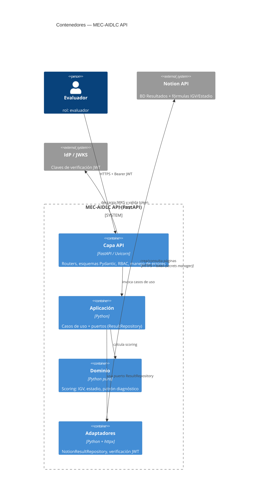

# C4 — Diagrama de Contenedores

> **Trust boundary** en la capa API: validación de esquema + verificación JWT antes de
> alcanzar la aplicación y el dominio. Los adaptadores son el único punto que habla con
> sistemas externos.
