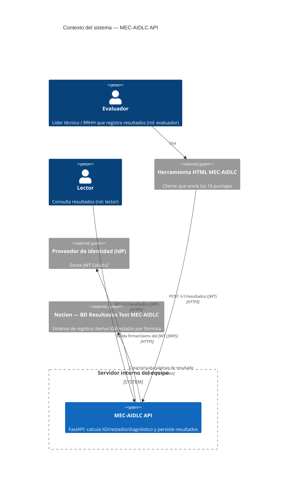

# C4 — Diagrama de Contexto

> **Trust boundary:** la línea del "Servidor interno del equipo". Todo lo que cruza esa
> frontera (cliente, IdP, Notion) es no confiable y exige validación / autenticación.
